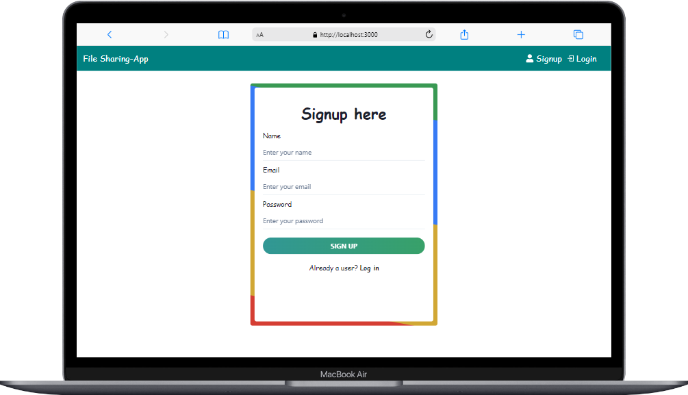

## Filesharing App

### A file sharing app is a software application that allows users to share files, such as documents, images, videos, and audio, between different devices or users. These apps usually work by creating a cloud-based storage space where files can be uploaded and accessed by authorized users. The app can be accessed through a web browser or a dedicated mobile application, and files can be shared through email, social media, or direct links

## Technology used

- Node
- Express
- Mongo
- React
- Redux Toolkit
- Chakra UI

## Screenshots

### Register User

### Login User

### Home

### Home Mobile Screen

### All Files

### All Flies Mobile Screen

### Download File

### Download File Mobile Screen

### Delete File

## Getting Started

-> To get started with the project, follow these steps:

1. Clone the repository to your local machine.
2. Install the required dependencies by running npm install.
3. Start the backend server by running npm run start.
4. Start the frontend server by running npm run start.
5. Open your browser and navigate to http://localhost:3000 to view the app.

## Usage

Once you have the app running, you can use it to store your file and download and delete your file .

# Deployed Link

### Frontend

https://filesharing-app.vercel.app/

### Backend

https://lord-file-share.glitch.me/
